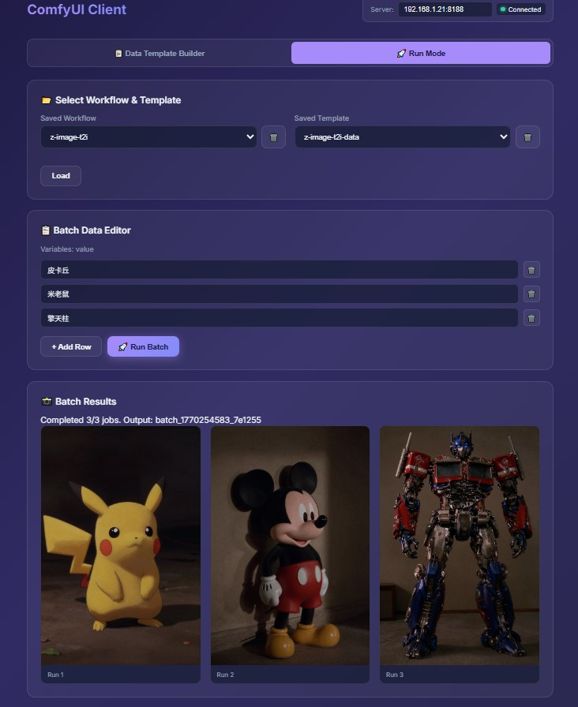

# ComfyUI Batch Client

> **一键将 ComfyUI workflow.json 转化为可视化批量调用工具**

Upload any ComfyUI workflow → Select variables → Run batch jobs visually.



## ✨ Highlights

- **零代码定制**: 上传 workflow.json，选择要暴露的参数，即可生成可视化调用界面
- **批量执行**: 一次配置多组参数，批量运行工作流
- **模板复用**: 保存配置为模板，下次直接调用
- **结果管理**: 所有输出自动保存，方便查看和下载

## Quick Start

```bash
# Install dependencies
pip install -r requirements.txt

# Start web server
python scripts/server.py
```

Open http://127.0.0.1:8000

## Usage

### Single Run
1. Upload `workflow.json`
2. Select variables to expose
3. Fill values and run

### Batch Mode
1. Select saved workflow + template
2. Add multiple data rows
3. Run batch → results saved to `data/outputs/`

### CLI

```bash
python scripts/run.py run --template my_template.json --batch batch.json
```

## Project Structure

```
├── scripts/
│   ├── server.py      # Web server
│   └── run.py         # CLI tool
├── comfyuiclient/     # ComfyUI client library
├── web/index.html     # Web UI
└── data/              # Saved workflows, templates, outputs
```

## Environment

```bash
export COMFY_BASE_URL="192.168.1.21:8188"
```

## Acknowledgments

This project is based on [sugarkwork/Comfyui_api_client](https://github.com/sugarkwork/Comfyui_api_client). Thanks for the excellent ComfyUI client library!

## License

MIT
