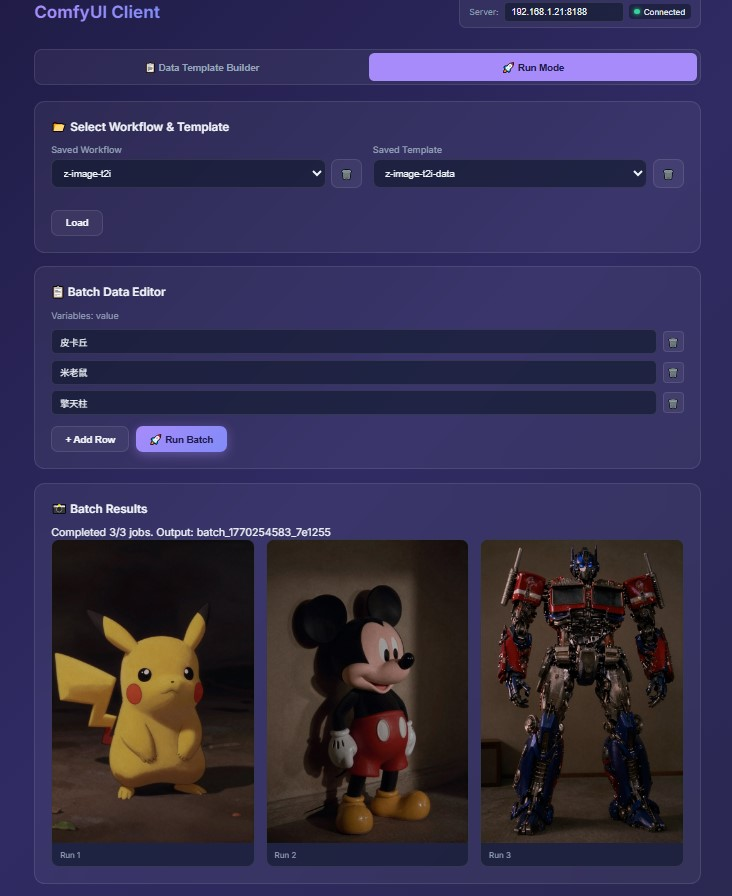

# ComfyUI Batch Client

> **一键将 ComfyUI workflow.json 转化为可视化批量调用工具**

Upload any ComfyUI workflow → Select variables → Run batch jobs visually.



## ✨ Highlights

- **零代码定制**: 上传 workflow.json，选择要暴露的参数，即可生成可视化调用界面
- **批量执行**: 一次配置多组参数，批量运行工作流
- **灵活输入**: 手动填写、**批量上传图片**、或指定服务器文件夹，三种方式任选
- **一键发布 API**: 参数确定后，给它起个名字就能把工作流变成可调用的 HTTP API（含列表页、详情页、一键复制调用示例）
- **PDF 导出**: 一键将批量结果导出为带参数的精美 PDF 报告，本地保存
- **模板复用**: 保存配置为模板，下次直接调用
- **结果管理**: 所有输出自动保存，方便查看和下载

## Quick Start

```bash
# Install dependencies
pip install -r requirements.txt

# Start web server
python scripts/server.py
```

Open http://127.0.0.1:8930

## Usage

### Single Run
1. Upload `workflow.json`
2. Select variables to expose
3. Fill values and run

### Batch Mode
1. Select saved workflow + template
2. Provide inputs in one of three ways:
   - **Manual**: add data rows by hand
   - **Upload Images**: drop / pick many images at once — each becomes one job
   - **Server Folder**: point at a folder on the server machine
3. Run batch → results saved to `data/outputs/`
4. Click **📄 Export PDF** to download a report of the results (also available in the Browse tab)

### Publish as an API

Once your parameters are set (in **Data Template Builder** or **Run Mode**), click **🔌 Create API**, give it a
name, and the workflow becomes a callable endpoint. The **🔌 APIs** tab lists every API; click one to see its full
calling spec with one-click copy:

```bash
curl -X POST "http://<host>:<port>/api/v1/<api_name>" \
  -H "Content-Type: application/json" \
  -d '{"image": "https://example.com/input.png", "prompt": "a cat", "seed": 123}'
```

- **Image inputs must be public URLs** — the server downloads them before running. Local file paths are rejected.
- **Image results are returned as base64.** Each item in `outputs[]` has `base64` (base64-encoded image bytes) plus `mime_type` and a hosted `url`:

```json
{
  "job_id": "api_...",
  "outputs": [
    { "type": "image", "filename": "result.png", "mime_type": "image/png", "base64": "iVBORw0KGgo...", "url": "http://<host>/api/outputs/<job_id>/result.png" }
  ]
}
```
- A built-in **⚡ Try it** panel on the detail page lets you run the API straight from the browser.
- API definitions live in `data/apis/`; each call's results also appear in the **Browse** tab.

**Build a client with AI** — the detail page has one-click copy for the **URL**, **input params**, **response params**
and **error codes**. The headline **🤖 Copy full spec (OpenAPI)** button (and the `…/openapi.json` spec URL) gives you a
standard OpenAPI 3.1 document you can paste into any AI / codegen tool to generate a ready-to-use client:

```
GET http://<host>:<port>/api/apis/<api_name>/openapi.json
```

### CLI

```bash
python scripts/run.py run --template my_template.json --batch batch.json
```

## Project Structure

```
├── scripts/
│   ├── server.py      # Web server
│   └── run.py         # CLI tool
├── comfyuiclient/     # ComfyUI client library
├── web/index.html     # Web UI
└── data/              # Saved workflows, templates, apis, outputs
```

## Environment

```bash
export COMFY_BASE_URL="192.168.1.21:8188"
```

## Acknowledgments

This project is based on [sugarkwork/Comfyui_api_client](https://github.com/sugarkwork/Comfyui_api_client). Thanks for the excellent ComfyUI client library!

## License

MIT
